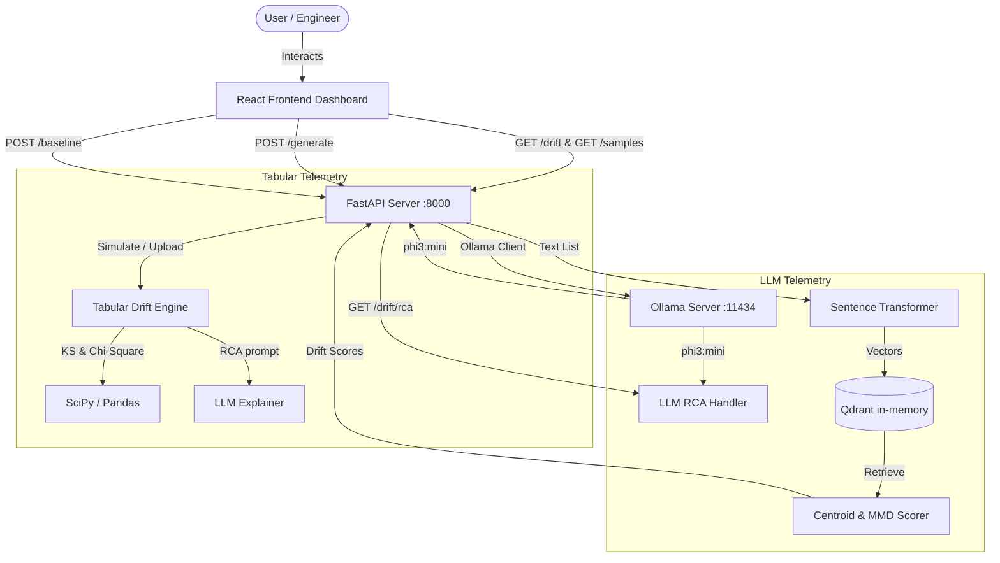

# Driftium - MLOps Drift Monitor & LLM Observability Platform

[](https://fastapi.tiangolo.com)
[](https://react.dev)
[](https://vitejs.dev)
[](https://qdrant.tech)
[](https://ollama.com)
[](https://docs.pytest.org)

Driftium is an open-source, recruiter-friendly MLOps telemetry console and LLM observability platform. It is designed to trace statistical feature drift in tabular data pipelines and semantic distribution shifts in Large Language Model (LLM) responses. By analyzing incoming production telemetry against reference baselines, Driftium translates abstract distribution deltas and topic shifts into developer-friendly, LLM-generated Root Cause Analysis (RCA) summaries.

---

## Overview

### What Problem the Project Solves
As machine learning models and LLMs run in production, they inevitably suffer from silent degradation. Shifted demographic distributions, system pipeline bugs, or changing prompt topics introduce **data drift** and **semantic drift**. Driftium detects these regressions before they corrupt downstream applications by providing:
*   **Continuous Statistical Alarms** for structured, tabular feature datasets.
*   **Semantic Observability** to detect topic shifts, vocabulary shifts, and system performance anomalies in LLM response distributions.
*   **Contextual Explanations** that translate raw numerical scores into natural language diagnostics using a local LLM agent.

### Key Objectives
*   **Tabular Diagnostics**: Detect continuous and categorical feature drift feature-by-feature using mathematical distribution tests.
*   **LLM Observability**: Monitor LLM semantic response variance by mapping outputs into high-dimensional vector spaces and analyzing population distances.
*   **Automated Root Cause Analysis (RCA)**: Explain *why* drift has occurred rather than just flagging that it happened, comparing telemetry patterns against stable baselines.
*   **Sandbox Experimentation**: Provide an interactive Playground to engineer prompts, generate real-time responses, and set stable baseline metrics.

### Brief Architecture Overview
Driftium features a single-server backend built with FastAPI that exposes two mounted subsystems: a legacy statistical data monitoring service and a semantic LLM observability application. The subsystems utilize Sentence Transformers (`all-MiniLM-L6-v2`) and a local Qdrant vector database to vectorize and store telemetry. The React frontend communicates with the unified server on port `8000` to render dynamic health indexes, stability trend lines, and sample comparisons.

---

## Features

### Implemented Features (Active in Codebase)
*   **LLM Observability Dashboard**:
    *   **Health Index**: A 100-point scale evaluating prompt-to-response alignment based on average cosine distance.
    *   **Maximum Mean Discrepancy (MMD)**: Kernel-based MMD scoring using Radial Basis Functions (RBF) to measure distribution-level semantic shifts.
    *   **Stability Trend Line**: Graph tracing the historical health index and MMD scores over the last 20 calculations.
    *   **Response Comparer**: Side-by-side view of active baseline responses vs. current telemetry responses.
*   **Interactive Prompt Playground**:
    *   **Direct Generation**: Send custom prompt instructions to local Ollama (`phi3:mini`) and view responses instantly.
    *   **Baseline Promotion**: Promote current telemetry response lists to the baseline pool with a single click (`POST /baseline`).
*   **LLM-Powered Root Cause Analysis**:
    *   **Semantic RCA Card**: Compares baseline samples against current telemetry responses and queries Ollama to output structured topic-shift summaries.
    *   **Offline Fallbacks**: Graceful rule-based fallback defaults to statistical summaries when the Ollama daemon is offline or returns an invalid structure.
*   **Tabular Data Drift Monitoring**:
    *   **Kolmogorov-Smirnov (KS) Test**: Compares continuous/numeric fields to detect distribution variances.
    *   **Chi-Square & Cramer's V**: Evaluates categorical fields and ranks them by effect size.
    *   **Interactive Simulation**: Filters baseline demographics to simulate shifts (e.g. `age < 35`) or accepts custom CSV uploads.
    *   **Tabular LLM Explainer**: Summarizes flagged tabular drift anomalies in natural language.

### Planned Features (Roadmap)
*   **Persistent Relational Database**: Migrate in-memory response lists and historical drift logs to a persistent PostgreSQL schema.
*   **Automated Scraper Cron Jobs**: Schedule background scrapers to pull model logs automatically instead of relying on manual playground generations.
*   **Alert Webhook Integrations**: Route critical drift severity alerts directly to Slack, Teams, or PagerDuty.

---

## Tech Stack

### Frontend
*   **Core**: React 18 (Functional components, hooks, local state mapping)
*   **Tooling**: Vite (Hot module reloading, dev server, compilation bundling)
*   **Styling**: Vanilla CSS (Modern dot-matrix theme, glassmorphic grids, custom cards)
*   **Icons**: Lucide React

### Backend
*   **Framework**: FastAPI (Asynchronous ASGI server routing)
*   **Web Server**: Uvicorn
*   **Data Processing**: Pandas, NumPy, SciPy (for Kolmogorov-Smirnov and Chi-square statistics)

### Database
*   **Vector Database**: Qdrant (Client running in local `:memory:` mode for prompt-response embedding comparisons)
*   **Data Storage**: In-memory telemetry queues and historical trend arrays

### MLOps / AI Components
*   **Embedding Pipeline**: Sentence Transformers (`all-MiniLM-L6-v2` generating 384-dimensional vector embeddings)
*   **Local LLM Host**: Ollama (`phi3:mini` for playground generation and RCA agent summaries)

### Infrastructure
*   **CI & Automation**: GitHub Actions workflow (automating linting, formatting, and unit tests)
*   **Testing**: Pytest framework (running statistical, database, and validation checks)

---

## System Architecture

### Data Flow
1.  **Ingestion**: The user either loads a simulated demographic dataset, uploads a custom CSV, or executes prompts in the Playground.
2.  **Vectorization**: For LLM telemetry, the backend passes generated texts to the Sentence Transformer model to compute 384-dimensional vector embeddings.
3.  **Indexing**: Embeddings are stored in the Qdrant in-memory vector database, grouped by baseline and current telemetry pools.
4.  **Metric Computation**: The backend runs the Centroid Cosine Distance and MMD tests on the vector distributions.
5.  **RCA Generation**: If drift is present, the backend sends sample outputs to Ollama to summarize the semantic shift, falling back to a rule-based generator if Ollama is unreachable.
6.  **Visualization**: The React UI polls/fetches these endpoints and updates metrics, historical trends, and text cards dynamically.

### Component Interactions


---

## Project Structure

```text
mlops-drift-monitor/
├── frontend/                     # React / Vite SPA frontend
│   ├── src/
│   │   ├── App.jsx               # Dashboard application, layout grids, and sections
│   │   ├── api.js                # API client integration communicating with FastAPI
│   │   ├── main.jsx              # React app entry point
│   │   └── styles.css            # Dark theme styles, layouts, and animations
│   ├── package.json              # Frontend node packages & run scripts
│   └── vite.config.js            # Vite configurations
├── src/                          # Backend source code modules
│   ├── llm_monitoring/           # LLM Observability & Semantic Drift Engine
│   │   ├── api.py                # LLM API endpoints (/generate, /drift, /samples, /drift/rca)
│   │   ├── embedder.py           # Sentence Transformers embedding mapping
│   │   ├── llm_drift_scorer.py   # Centroid distance and MMD calculation
│   │   ├── simulator.py          # Standalone simulation testing logic
│   │   ├── inference_server.py   # Dedicated LLM completion server
│   │   └── vector_store.py       # In-memory Qdrant client utility
│   ├── monitoring/               # Tabular Feature Drift Engine
│   │   ├── api.py                # Main FastAPI Server app (with LLM sub-app mounted)
│   │   ├── drift_detection.py    # Statistical tests (KS, Chi2, Cramer's V)
│   │   └── service.py            # Data loading, payload building, and simulations
│   └── llm/                      # Tabular LLM RCA agent
│       └── llm_explainer.py      # Ollama helper for tabular RCA
├── tests/                        # Automated Pytest suite
│   ├── test_drift_detection.py   # Statistical check validations
│   ├── test_vector_store.py      # Qdrant vector store upsert/retrieval checks
│   └── test_monitoring_service.py # Tabular service integrations
├── main.py                       # CLI workflow entry point
├── pytest.ini                    # Pytest framework configurations
└── requirements.txt              # Python requirements and package list
```

### Directory Explanation
*   `frontend/`: The client application. Built as a Single Page Application (SPA) using React, custom CSS, and Lucide React.
*   `src/llm_monitoring/`: Houses the LLM monitoring endpoints, Sentence Transformers embeddings pipeline, in-memory Qdrant client, and the Centroid/MMD scoring math.
*   `src/monitoring/`: Houses the main FastAPI server setup, mounting configurations, and statistical drift test pipelines for structured tabular data.
*   `src/llm/`: Hosts the prompt engineering models and agents that explain tabular data drift anomalies.
*   `tests/`: Verification scripts covering statistical accuracy, vector ingestion, and edge cases.

---

## Setup & Installation

### Prerequisites
*   **Python**: Version 3.10+
*   **Node.js**: Node 18+ (with `npm`)
*   **Ollama**: Installed and running locally. Run the model using:
    ```bash
    ollama pull phi3:mini
    ```

### Backend Setup
1.  Navigate to the root directory and create a virtual environment:
    ```bash
    python -m venv venv
    ```
2.  Activate the virtual environment:
    *   **Windows**:
        ```powershell
        .\venv\Scripts\activate
        ```
    *   **macOS/Linux**:
        ```bash
        source venv/bin/activate
        ```
3.  Install dependencies:
    ```bash
    pip install -r requirements.txt
    ```

### Frontend Setup
1.  Navigate to the `frontend` folder:
    ```bash
    cd frontend
    ```
2.  Install npm packages:
    ```bash
    npm install
    ```

### Environment Variables
To customize the connection URL, create a `.env` file in the `frontend` folder:
```env
VITE_API_BASE_URL=http://127.0.0.1:8000
```

### Running the Application
1.  Start the FastAPI backend server:
    ```bash
    uvicorn src.monitoring.api:app --reload --port 8000
    ```
2.  In a separate terminal, launch the React development server:
    ```bash
    cd frontend
    npm run dev
    ```
3.  Navigate to `http://127.0.0.1:5173` to view the Driftium Dashboard.

---

## API Endpoints

| Endpoint | Method | Purpose | Request Body | Response Shape |
| :--- | :--- | :--- | :--- | :--- |
| `/api/health` | `GET` | API status and availability check | None | `{"status": "ok", "generated_at": "..."}` |
| `/api/monitoring/simulated` | `GET` | Retrieve tabular simulated drift payload | Query parameters: `age_threshold` (int), `p_threshold` (float) | `{"generated_at": "...", "summary": {...}, "display_rows": [...]}` |
| `/api/monitoring/upload` | `POST` | Upload a custom CSV for tabular drift analysis | Binary CSV payload | `{"generated_at": "...", "summary": {...}, "display_rows": [...]}` |
| `/api/rca` | `POST` | Generate tabular RCA explaining numerical shifts | `{"feature": "balance", "drift_rows": [...], "incoming_source_description": "..."}` | `{"available": true, "content": "...", "error": null, "model": "..."}` |
| `/generate` | `POST` | Get LLM response completion and append to telemetry pool | `{"prompt": "text"}` | `{"id": "...", "prompt": "...", "response": "...", "timestamp": "..."}` |
| `/baseline` | `POST` | Promote current telemetry responses to the baseline pool | None | `{"message": "Baseline set successfully", "baseline_size": 4}` |
| `/drift` | `GET` | Calculate LLM semantic drift scores and append to history | None | `{"centroid_score": 0.22, "mmd_score": 0.05, "severity": "LOW", "timestamp": "..."}` |
| `/drift/history` | `GET` | Retrieve last 20 drift history calculation logs | None | `[{"timestamp": "...", "centroid_score": 0.22, "mmd_score": 0.05, "severity": "LOW"}]` |
| `/samples` | `GET` | Fetch active baseline and current telemetry text samples | None | `{"baseline": ["..."], "current": ["..."]}` |
| `/drift/rca` | `GET` | Compare response pools and return semantic topic shift analysis | None | `{"baseline_size": 4, "telemetry_size": 3, "severity": "CRITICAL", "summary": "...", "possible_cause": "..."}` |

---

## Drift Monitoring Workflow

### 1. Feature Drift Detection Flow (Tabular)
1.  **Ingest Production Batch**: Production telemetry data is ingested via simulated subsets (e.g. filtering age) or custom CSV uploads.
2.  **Numerical Statistics**: Continuous features are evaluated using the Kolmogorov-Smirnov (KS) test comparing incoming data to baseline reference data. Columns with a p-value below the target threshold (default `0.05`) are flagged.
3.  **Categorical Statistics**: Categorical features are analyzed with a Chi-square contingency test. Cramer's V is computed to rank the severity of the shift.
4.  **Tabular RCA**: Flagged columns are sent to the tabular LLM explainer where a prompt compiles reference ranges and current statistics to output a natural language explanation.

### 2. LLM Drift Evaluation Flow (Semantic)
1.  **Playground Ingestion**: Prompt logs are routed to `/generate` where the local Ollama instance outputs text responses and appends them to the telemetry pool.
2.  **Embedding Generation**: The baseline and current response pools are passed to the `all-MiniLM-L6-v2` encoder model, converting sentences into 384-dimensional dense vectors.
3.  **Vector Database Indexing**: Embeddings are stored in separate baseline and current collections in the in-memory Qdrant vector database.
4.  **Divergence Metric Scoring**:
    *   **Centroid Distance**: Computes the cosine distance between the mean vectors of the baseline and current populations.
    *   **Maximum Mean Discrepancy (MMD)**: Calculates kernel-based distribution distance to identify subtle structural variations.
5.  **Semantic RCA Summary**: The system triggers Ollama to compare text samples directly, identifying topic shifts, keyword deviations, or tone shifts.

---

## Screenshots / Demo

### Product Landing Page

*A sleek dot-matrix dashboard landing layout demonstrating real-time health indicators and drift status.*

### LLM Observability Dashboard

*Visualizes semantic health scores, MMD metrics, active history trend lines, and the LLM-powered RCA summary.*

### Interactive Playground

*Allows sandbox prompt testing, response generations, and baseline promotions.*

---

## Current Limitations
*   **Transient Memory Lifecycles**: Since Qdrant runs in-memory and telemetry history arrays are cached in FastAPI global variables, restarting the backend server resets all response pools and trend histories.
*   **Local Hardware Bottlenecks**: Processing completions on CPU/GPU via Ollama is subject to local compute latencies. If the local system experiences resource strain, playground generation times will increase.

---

## Future Improvements
*   **Database Ingestion Layers**: Integrate SQLite/PostgreSQL connectors to persist drift logs, telemetry text, and baseline histories permanently.
*   **Asynchronous Inference Queues**: Introduce Celery or Redis queues to process prompt generations asynchronously, preventing request timeouts.
*   **Metric Alerting Rules**: Implement customizable drift severity thresholds to dispatch webhooks to production alerts automatically.

---

## Resume Highlights
*   **Built an End-to-End MLOps Drift Monitor & LLM Observability Platform** utilizing FastAPI, React (Vite), Sentence Transformers, and Qdrant to detect tabular and semantic drift in real-time.
*   **Engineered Statistical Analysis Engines** in Python using SciPy to perform Kolmogorov-Smirnov (KS) and Chi-square contingency tests, flagging feature deviations in incoming dataset telemetry.
*   **Implemented High-Dimensional LLM Observability** by computing centroid cosine distance and Maximum Mean Discrepancy (MMD) scores over 384-dimensional response embeddings.
*   **Integrated Local LLM Agents** utilizing Ollama (`phi3:mini`) to compare response pools and perform automated, natural language Root Cause Analysis (RCA) on detected semantic anomalies.
*   **Designed a Robust Unified Server Architecture** using FastAPI sub-app mounting to bundle tabular and LLM observability engines under a single CORS configuration on port 8000.
*   **Authored Exhaustive Automated Test Suites** in Pytest validating vector database writes, statistical thresholds, CLI CSV exporters, and empty-state fallbacks.

---

## Interview Talking Points

### Why the Project Was Built
ML and LLM deployments suffer from silent degradation. Standard APM tools (e.g. Datadog) monitor system status like CPU or latency, but cannot spot mathematical data drift or semantic topic shifts. Driftium was built to bridge this gap, giving AI engineers a unified visual dashboard that alerts on distribution shifts and provides prompt explanations of *why* the data shifted.

### Design Decisions
*   **Embedding Model Selection**: Sentence Transformers (`all-MiniLM-L6-v2`) was selected because it generates compact 384-dimensional vector embeddings, significantly reducing memory footprint and processing latency compared to larger models, while maintaining rich semantic density.
*   **FastAPI Sub-App Mounting**: Rather than managing multiple backend servers, ports, and CORS setups, mounting the LLM observatory at the root `/` of the tabular monitoring app enables single-port execution.
*   **Rule-Based Exception Handling**: LLM services hosted locally can be volatile. The RCA module detects Ollama timeouts or failure codes and gracefully falls back to deterministic rule-based analysis, ensuring high system uptime.

### Challenges Solved
*   **Stale Dashboard Telemetry Trends**: Resolved a bug where the `/drift` evaluation endpoint generated metrics but failed to store them. Implemented a telemetry logging array in the backend (`drift_history`) to record scores, resolving the flat dashboard trend line.
*   **Sub-App Route Conflicts**: Solved routing blockages by arranging endpoints such that specific static routes take precedence, while mounting the sub-app as a root-level fallback.

### Scalability Considerations
*   **Vector Query Scaling**: In production, querying vector distances over millions of runs can be slow. Implementing collection partitions and index HNSW graphs in Qdrant ensures sub-millisecond distance lookups.
*   **Batching Embeddings**: Rather than vectorizing incoming responses individually, batching text arrays before sending them to the encoder pipeline minimizes redundant GPU/CPU overhead.

---

## Author

Shravani Rane
MCA MET'27

## License

Driftium is released under the [MIT License](file:///c:/Users/Shravani/Desktop/Projects/mlops-drift-monitor/LICENSE).
